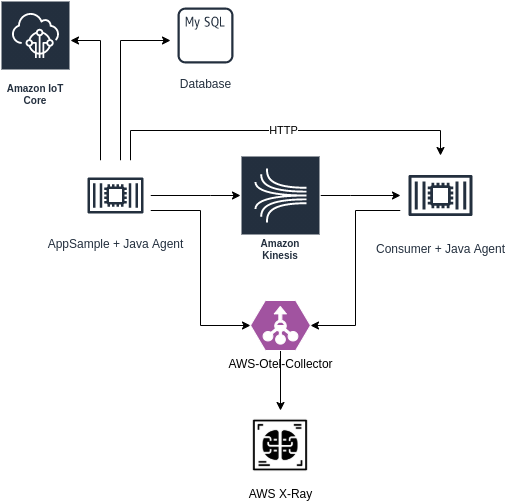
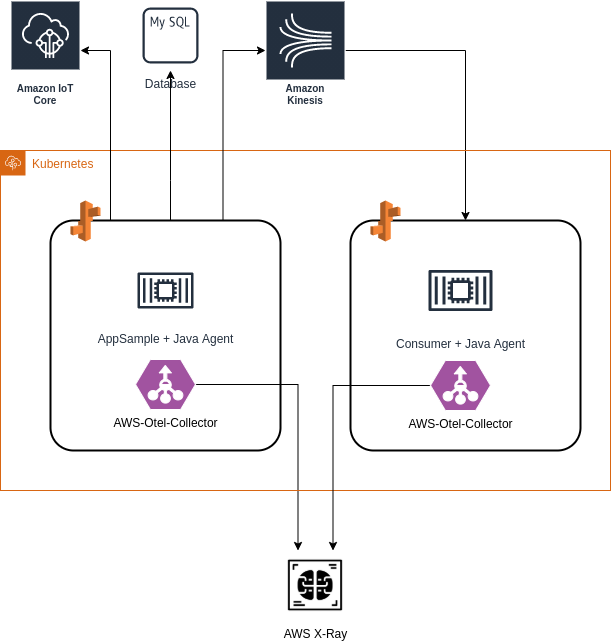

# AWS X-Ray Opentelemetry POC

POC para verificar as capacidades da AWS de utilizar instrumentalização Opentracing nos serviços.

Esta POC precisa responder as seguintes questões:

1 - Como instrumentalizar uma aplicação Spring + Jetty com Opentracing

2 - Como configurar a instrumentalização Opentracing com AWS X-Ray

3 - Como instrumentalização a aplicação Opentracing+X-Ray nos serviços

## Antes de começar

Devem ser configuradas as credenciais AWS (Access-Key/Secret).

Adicionar as Policies necessárias, conforme documentado em https://aws-otel.github.io/docs/setup/permissions

Ler as seguintes documentações:

- Opentelemetry - https://opentelemetry.io/docs/
  - Conceitos básicos de telemetria
  - Motivos pelo qual Opentelemetry foi criado
  - Funcionamento da arquitetura de Opentelemetry
- AWS X-Ray - https://docs.aws.amazon.com/xray/latest/devguide/aws-xray.html
  - O que é o serviço X-Ray
  - Conceitos básicos do serviço
  - A relação com o serviço de telemetria
- AWS Distro for Opentelemetry - https://aws-otel.github.io/docs/introduction
  - Como a AWS se adaptou para dar suporte ao Opentelemetry
  - Como instrumentalizar uma aplicação na AWS para o Opentelemetry
- Minikube - https://minikube.sigs.k8s.io/docs/
  - Caso queira executar a POC dentro do cluster Kubernetes local

Criar um Stream no Kinesis com o nome `test` com acesso para o usuário da AWS informado.

Inicializar um servidor MySQL para que o endpoint que acessa a base de dados possa ser testado.

## Arquitetura da POC

Arquitetura básica:



Foram criados 2 serviços (chamados appsample e consumer). Cada um dos serviços foi configurado para que envie traces no modelo Opentracing para o AWS X-Ray.

Os serviços possuem as seguintes características:

### Appsample

Possuir endpoints HTTP que:

- Responda uma requisição de hello (`/appsample/hello`)
- Realize uma requisição a base de dados (`/appsample/database`)
- Realize uma requisição a outro serviço (`/appsample/backend`)
- Faça uma publicação de mensagem no IoT Core (`/appsample/iot`)
- Faça uma publicação de mensagem no Kinesis (`/appsample/kinesis`)

Variáveis de ambiente para configuração do serviço:

- `OTEL_OTLP_ENDPOINT` - Endpoint para requisições ao Coletor de traces (collector)
- `OTEL_RESOURCE_ATTRIBUTES` - Atributos adicionais para o collector, como nome do serviço e namespace
- `OTEL_METRICS_EXPORTER` - Definição se envia ou não métricas
- `AWS_ACCESS_KEY_ID` e `AWS_SECRET_ACCESS_KEY` - Credenciais AWS
- `DATABASE_URL`, `DATABASE_USER` e `DATABASE_PASSWORD` - Credenciais de base de dados (utilizado MySQL)
- `AWS_IOT_CLIENT_ENDPOINT` - Endpoint AWS IOT
- `AWS_IOT_CERTIFICATES_PATH` - Certificados AWS (devem ser colocados com o nome cert.pem e key.pem dentro da pasta certs na raiz do serviço)
- `BACKEND_URL` - URL base do serviço consumer

Para executar localmente, usa-se o comando:

```shell
gradle appRun
```

### Consumer

- Possuir um endpoint que responda a uma requisição de hello (`/consumer/hello`) 
- Consuma um stream do Kinesis

Variáveis de ambiente para configuração do serviço:

- `OTEL_OTLP_ENDPOINT` - Endpoint para requisições ao Coletor de traces (collector)
- `OTEL_RESOURCE_ATTRIBUTES` - Atributos adicionais para o collector, como nome do serviço e namespace
- `OTEL_METRICS_EXPORTER` - Definição se envia ou não métricas
- `AWS_ACCESS_KEY_ID` e `AWS_SECRET_ACCESS_KEY` - Credenciais AWS

Para executar localmente, usa-se o comando:

```shell
gradle appRun
```

### Java Agent

A instrumentalização dos serviços foi realizada de forma automática, através de um agente que executa em conjunto com a aplicação.

A documentação da configuração deste agente está em: https://aws-otel.github.io/docs/getting-started/java-sdk/trace-auto-instr

Para fins da criação das imagens dos serviços localmente e sua execução, o arquivo .jar do agente está dentro da pasta `libs` de cada um dos serviços. 

A task gradle bootRun já executa o agente, conforme está configurado no build.gradle de cada serviço, de acordo com a documentação no link acima 

### AWS Otel Collector

O Java Agent não envia as métricas/tracing diretamente para o serviço de Observability. Ao invés disto, ele utiliza um Collector, que deve ser iniciado separadamente.

Para execução local, este collector foi executado via Docker-Compose. Os arquivos de configuração usados estão em [aws-otel-collector](aws-otel-collector) e a dcumentação dele está em: https://aws-otel.github.io/docs/getting-started/collector

O arquivo `docker-compose.yml` deve ser alterado para incluir as credenciais da AWS necessárias

# Visualização dos Traces

Após executar os serviços e o AWS Otel Collector, acesse com um navegador os endpoints disponíveis em cada um dos serviços para gerar alguns traces.

Para visualizar os traces, acesse a console do X-Ray com o seu usuário em: https://console.aws.amazon.com/xray/home

# Executando no Kubernetes

Para validar a execução em ambiente Kubernetes, a arquitetura mudou um pouco. Como recomendado pela AWS, testou-se um modelo de deploy do serviço utilizando o Collector como um [Sidecar](https://docs.microsoft.com/pt-br/azure/architecture/patterns/sidecar).

O modelo desta arquitetura está demonstrado na imagem abaixo:



Para a POC, utilizou-se o [minikube](https://minikube.sigs.k8s.io), a fim de que pudéssemos testar localmente os conceitos.

Existem arquivos de configuração do K8S para criação do serviço e do deployment em cada um dos serviços. Eles devem ser configurados com as variáveis de ambiente correspondentes.

Para cada um dos serviços pode ser executado o comando `k8s/build-image.sh <tagImage>`, que cria a imagem e envia para o registro de imagens do minikube.

Para realizar o deploy/undeploy dos serviços no Minikube, basta executar os comandos `k8s/create.sh` ou `k8s/delete.sh`

# Respondendo as Perguntas

1 - Como instrumentalizar uma aplicação Spring + Jetty com Opentracing

Utilizamos a maneira mais simples, importar as dependências do Opentracing no projeto e utilizar o agente Java para realizar a instrumentalização automática. Alguns traces específicos foram instrumentalizados via código com a anotação `@Span`, mas a necessidade de alteração de código é apenas em pontos onde quisermos traces específicos.

2 - Como configurar a instrumentalização Opentracing com AWS X-Ray

Com o serviço instrumentalizado com o agent, configura-se o agente para enviar as métricas/traces para o AWS-OTel-Collector. Ele possui exporters para diferentes soluções de telemetria, incluindo o X-Ray.

3 - Como instrumentalização a aplicação Opentracing+X-Ray nos serviços

Com a utilização do agente e do collector. A partir daí podemos decidir se queremos que o Collector execute como um Sidecar (podendo realizar o export de métricas também, mas sacrificando um pouco o uso de memória do pod) ou se utilizamos um collector como serviço separado (com o ônus de necessitar configurações adicionais de TLS nos serviços e uma latência maior nas requisições).
